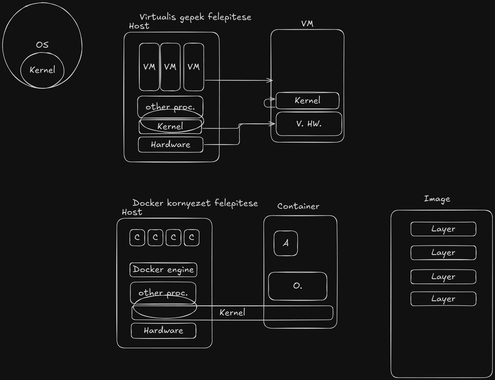

# 󰡨 Docker Workshop 󰡨

Demo application containerization example with Docker

## How docker works



## Prerequisites

In this demo you need to have Git and Docker installed to follow the project.

###  Git

####  Linux

󰣇 Arch:

```bash
sudo pacman -S git
```

 Deb:

```bash
sudo apt isntall git-all
```

 RPM:

```bash
sudo dnf install git-all
```

####  Windows

[Installation Link](https://git-scm.com/downloads/win)

---

### 󰡨 Docker

#### 󰡨 Docker CE

Docker CE is coming with only cli option

[Docker CE Install](https://docs.docker.com/engine/install/)

#### 󰡨 Docker Desktop

[Docker Desktop on Linux](https://docs.docker.com/desktop/setup/install/linux/)
[Docker Desktop on Windows](https://docs.docker.com/desktop/setup/install/windows-install/)

Installing Docker on Windows can get tricky.
We can go over it on the workshop or beforehand.

---

### About

In this workshop we will containerize an application written in Go.

- Go down on the basics of the hows and whys on Docker
- Make a basic image
- Improve the image
- Securing the image
- Running multiple containers with orchestration
- Public repos and fun apps to run on Docker
- Optimization
